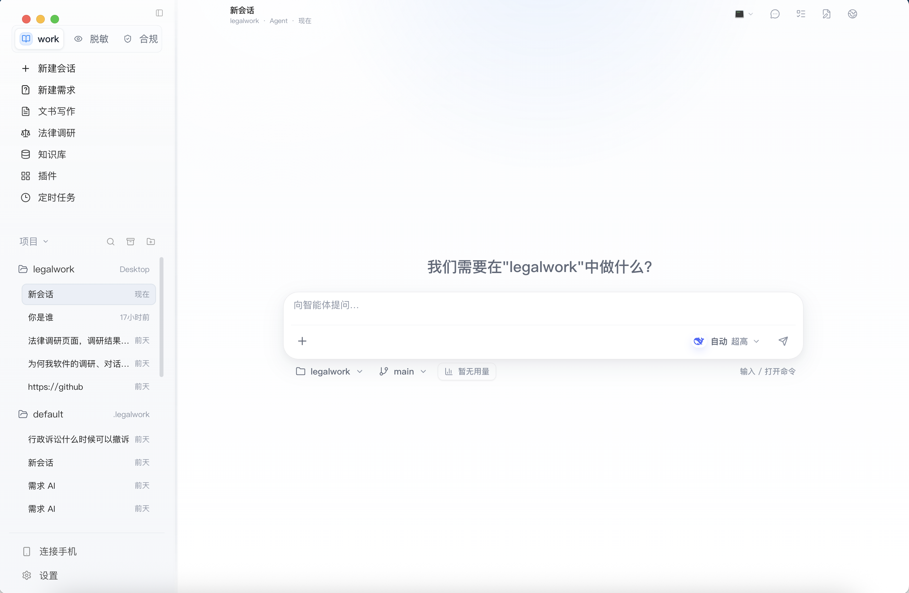

# LegalWork — 法律人工智能工作台

<p align="center">
  
</p>

> 🏛️ 面向法律专业人士的 AI 赋能平台<br>
> 集成 OCR 文档识别、敏感信息脱敏、智能案情分析、法律检索、文书生成、合规审查等完整法律 AI 能力

## ✨ 功能全景

### 🧠 69 项法律 AI 技能（Skills）

LegalWork 内置了覆盖法律工作全流程的 AI 技能库，按领域分类：

#### 📊 案件分析与推理
| 技能 | 说明 |
|------|------|
| `legal-case-analysis` | 案情综合分析 |
| `fact_extraction` | 案件关键事实抽取 |
| `evidence_evaluation` | 证据三性认证与证明力评估 |
| `evidence_argument_chain` | 证据链构建与分析 |
| `evidence-catalog` | 证据目录生成与管理 |
| `argument_chain_construction` | 论证链构建 |
| `argument_strength_evaluation` | 论证强度评估 |
| `deductive_reasoning` | 演绎推理分析 |
| `inductive_reasoning` | 归纳推理分析 |
| `analogical_reasoning` | 类比推理分析 |
| `counterfactual_reasoning` | 反事实推理 |
| `legal_abductive_reasoning` | 法律溯因推理 |
| `systematic_interpretation` | 体系解释分析 |
| `teleological_interpretation` | 目的解释分析 |
| `normative_meaning_argumentation` | 规范意义论证 |
| `judicial_value_judgment` | 司法价值判断分析 |
| `formal_legal_consequence` | 形式法律后果分析 |

#### ⚖️ 裁判预测与评估
| 技能 | 说明 |
|------|------|
| `legal_judgment_prediction` | 裁判结果预测 |
| `legal_risk_assessment` | 法律风险评估 |
| `strategic_risk_prioritization` | 战略风险优先级排序 |
| `internal_compliance_risk_identification` | 内部合规风险识别 |
| `conflict_resolution` | 争议解决方案分析 |
| `dispute_issue_identification` | 争议焦点识别 |
| `dispute_and_performance_risk` | 履约风险分析 |

#### 📝 法律文书
| 技能 | 说明 |
|------|------|
| `document_drafting` | 法律文书起草 |
| `legal_document_formatting` | 法律文书格式规范化 |
| `legal_document_summarization` | 法律文书摘要生成 |
| `judgment_document_generation` | 判决文书生成 |
| `legal-memo-generator` | 法律备忘录生成 |
| `legal-assessment-report-skill` | 法律评估报告生成 |
| `legal-case-analysis-template` | 案例分析报告模板 |
| `legal-paper-anti-ai-traces` | 法学论文去 AI 痕迹 |
| `legal-thesis-ideation` | 法学论文选题构思 |
| `meeting_minutes` | 会议纪要生成 |
| `case_notebook` | 案件笔记整理 |

#### 🔍 法律检索与研究
| 技能 | 说明 |
|------|------|
| `legal_research` | 法律研究分析 |
| `legal_article_retrieval` | 法条检索 |
| `lawcase-search` | 案例检索 |
| `legal-source-verifier` | 法律来源验证 |
| `other_legal_retrieval` | 其他法律资料检索 |
| `chinese_law_verifier` | 中国法律条文核验 |
| `legal_norm_validity_check` | 法律规范效力审查 |
| `new_legislation_analysis` | 新法分析解读 |

#### 🔒 合规与风控
| 技能 | 说明 |
|------|------|
| `compliance_review` | 合规审查 |
| `contract_risk_review` | 合同风险审查 |
| `due_diligence` | 尽职调查分析 |
| `data-compliance-ai-rd` | AI 研发数据合规 |
| `presidio-data-compliance` | 数据合规（Presidio 集成） |
| `creator-rights-assistant` | 创作者权益保护 |

#### 📋 案件管理
| 技能 | 说明 |
|------|------|
| `case_management` | 案件管理 |
| `case_lifecycle_planning` | 案件生命周期规划 |
| `case_retrieval` | 案件检索 |
| `trial_scheduling_and_deadline_monitoring` | 庭审排期与期限监控 |
| `timeline_generation` | 时间线生成 |
| `billing_and_litigation_budget` | 计费与诉讼预算 |
| `client_communication` | 客户沟通辅助 |
| `team_knowledge_sharing` | 团队知识分享 |
| `legal_professional_growth` | 法律职业成长 |
| `legal_professional_philosophy` | 法律职业理念 |
| `legal_time_management` | 法律时间管理 |
| `legal_terminology` | 法律术语解释 |
| `legal_concept_comprehension` | 法律概念理解 |
| `legal_element_extraction` | 法律要素提取 |
| `structured_element_extraction` | 结构化要素提取 |
| `multi_document_summarization` | 多文档摘要 |
| `wps-case-file-organizer` | WPS 案件材料整理 |

#### 🛠️ 平台工具
| 技能 | 说明 |
|------|------|
| `ocr_extraction` | OCR 文字提取 |
| `redaction` | 文件脱敏 |

### 📄 OCR 智能文档识别

基于 `ocr_agent.py` 的完整文档处理流水线：

- **多格式支持**：PDF（含扫描件）、PNG、JPG、TIFF、BMP、WebP、DOCX
- **双引擎 OCR**：PaddleOCR（默认高精度）→ Tesseract（自动降级兜底）
- **自动判断**：`auto` 模式自动识别是否需要 OCR
- **批量处理**：目录批量 OCR 处理
- **LDIR 结构化输出**：统一的法律文档中间表示（Legal Document IR）
- **语义增强**：实体提取、条款层级解析、语义分块
- **坐标级输出**：返回文本块坐标（bbox）

```bash
python3 ocr_agent.py scan 扫描合同.pdf
python3 ocr_agent.py batch ./证据材料/
python3 ocr_agent.py pipeline 判决书.pdf
python3 ocr_agent.py auto 文件.docx
```

### 🔏 智能文件脱敏

基于 `redact_agent.py` 和 `redaction/` 模块的完整脱敏系统：

- **敏感实体识别**：身份证号、手机号、邮箱、银行卡号、车牌号、公司名、地址、案号、姓名、金额
- **三种脱敏策略**：
  - `external_client` — 对外发送（遮盖敏感信息）
  - `internal_legal_analysis` — 内部法律分析（Tokenize 保留可读性）
  - `public_release` — 公开发布（完全遮盖）
- **五种脱敏模式**：MASK、REPLACE、TOKENIZE、FULL_MASK、PARTIAL_MASK
- **PDF 坐标级涂黑**：PyMuPDF 像素级矩形覆盖 + 底层文本删除 + Metadata 清理
- **输出产物**：脱敏文档（.redacted.md）、脱敏映射表（.mapping.enc）、脱敏报告（.redaction_report.html）
- **参考规范**：`reference_redaction_mode.py` 提供脱敏模式参考文档

```python
from redaction.pipeline import RedactionPipeline

pipeline = RedactionPipeline()
result = pipeline.process_text(
    text="身份证号：110101199001011234，手机号：13800138000",
    policy_name="external_client",
)
```

### ⚙️ Skill Engine 技能引擎

`skill_engine/` 提供统一的技能执行框架：

- **标准化流程**：intake（文件读取）→ 技能 prompt 加载 → 结果保存
- **自动 OCR 触发**：扫描件自动走 OCR 提取
- **结构化输出**：统一的结果格式（文本、引擎、置信度）
- **CLI 调用**：`python3 run_skill.py <skill-name> <input-file>`

### 🗂️ 案件管理系统

`case_system/` 提供轻量级案件管理：

- **案件建模**：`core.py` 案件核心数据模型
- **Flask API**：`flask_api.py` RESTful 案件管理接口
- **可扩展**：支持自定义案件字段和状态流转

### 📚 知识库系统

知识库分为「内置法规数据」与「可托管知识库」两层，后者提供完整的文件管理 + 语义检索 + 自动分类能力，并以 13 个 AI 工具的形式开放给 Agent 直接调用。

#### 内置法规数据

`projects/compliance/` 内置海量中国法律法规数据库：

- **法律层级覆盖**：
  - 国家法律（个人信息保护法、数据安全法、网络安全法等）
  - 国家标准与行业标准（GB/T、YD/T 等 50+ 项）
  - 地方规范性文件（覆盖全国各省市）
- **适用场景**：数据合规审查、AI 研发合规、个人信息保护评估
- **持续更新**：可扩展的知识库体系

#### 托管知识库与语义检索

- **多目录接入**：自动扫描 `knowledge-base/`、`knowledge/`、`docs/` 及内置合规知识库等源目录，增量摄取、分块并重建检索索引（`knowledge_sync`）。
- **语义检索**：按关键词 / 法条 / 条款 / 案件名检索，返回带来源路径、匹配分数与摘录的排序结果（`knowledge_search`），条目支持 `category` / `tags` / `keywords` 元数据与排序理由（`rankReason`）。
- **一步自动检索**：给定问题或任务描述，自动检索相关文档、过滤过期/失效内容，并生成带来源引用、可直接注入模型的上下文块（`knowledge_auto_retrieve`）。
- **知识库诊断**：查看文档数、分块数、上次同步时间、启用状态与源目录（`knowledge_diagnostics`）。

#### 文件管理与多格式解析

- **树形浏览 / 读写 / 移动 / 新建目录 / 删除**：完整的知识库文件操作（`knowledge_list_tree`、`knowledge_read_file`、`knowledge_write_file`、`knowledge_create_folder`、`knowledge_move`、`knowledge_delete`）。
- **多格式文本抽取**：支持 Markdown、TXT、JSON/JSONL、CSV/TSV、YAML、HTML/XML 等文本格式，以及 PDF、Word（doc/docx）、Excel（xls/xlsx）等文档解析；并可托管 PPT、音频（mp3/m4a/wav/aac/flac）、图片等资料。

#### 自动分类整理

- **一键归档**：`knowledge_classify` 将混杂文件自动归类到实务类目文件夹——**法规规范、合同协议、诉讼仲裁、案例判例、调研报告、模板范本、音视频、图片资料、表格数据、其他资料**。
- **可预览可选择**：支持 `dryRun` 预览规划中的移动、指定目标根目录、仅处理选中文件；每次移动附归类理由。

#### 外部权威法律源

- **国家法律法规数据库实时检索**：`legal-external-search` 接入 [国家法律法规数据库](https://flk.npc.gov.cn)，支持多策略查询、法规详情抓取与正文 docx 下载解析。
- **权威来源清单**：`knowledge_legal_external_sources` 返回官方政府网站、司法数据库、学术法律平台等权威外部来源，用于查阅本地知识库之外的最新法规与案例。

#### 团队写作风格库

- `knowledge_writing_style` 提供团队写作风格指南：法律三段论结构、论证节奏、引注要求，以及起诉状、答辩状、法律意见书、代理意见等文书模板与风险提示模板，确保文书风格一致。

### 🧪 评估系统

`evals/` 提供质量评估框架：

- `redaction_evaluator.py` — 脱敏效果评估
- 可扩展的评估指标体系

### 📋 项目规划

`plans/` 包含完整的产品与技术规划文档：

- `legalwork-ai-system-plan-v1.md` — AI 系统技术方案
- `legalwork-product-details-v1.md` — 产品功能详情

---

## 🖥️ 桌面端应用

桌面子项目位于 `apps/desktop-legalwork/`，提供完整的本地 AI Agent 运行时：

- **本地 HTTP/SSE 服务**：`legalwork serve` 启动本地服务
- **线程管理**：创建、管理、fork 对话线程
- **模型集成**：支持 DeepSeek 等 API 兼容模型
- **MCP 协议支持**：集成 MCP 工具服务器
- **缓存优化**：Cache-first 架构，LRU/TTL 缓存
- **技能集成**：支持调用上述 69 项法律 AI 技能
- **记忆系统**：长期记忆存储与检索
- **知识检索**：RAG 知识库检索
- **附件处理**：图片上传与处理
- **Web 搜索**：内置网页抓取与搜索
- **子代理**：任务委派与并行执行

详见 `apps/desktop-legalwork/README.md`。

---

## 🚀 快速开始

### Python 环境

```bash
# 安装依赖
pip install -r requirements.txt

# OCR 依赖（可选）
pip install paddleocr pytesseract pymupdf Pillow

# 运行 OCR
python3 ocr_agent.py auto 文档.pdf

# 运行脱敏
python3 redact_agent.py 文档.docx

# 运行技能
python3 run_skill.py legal-case-analysis 案件材料.pdf
```

### 桌面端应用

```bash
cd apps/desktop-legalwork

# 安装依赖
npm install

# 开发模式
npm run dev

# 构建
npm run build

# 启动服务
legalwork serve --data-dir ~/.legalwork --api-key $API_KEY
```

---

## 🧩 项目结构

```
legalwork/
├── ocr_agent.py              # OCR 智能识别入口
├── redact_agent.py           # 文件脱敏入口
├── run_skill.py              # Skill 执行入口
├── run.sh                    # 服务启动脚本
├── setup.sh                  # 环境安装脚本
├── requirements.txt          # Python 依赖
│
├── document/                 # 文档处理流水线
│   ├── pipeline.py           #   主流水线
│   ├── intake/               #   文件入口路由
│   ├── ocr/                  #   OCR 引擎路由
│   ├── ldir/                 #   LDIR 结构化输出
│   ├── parser/               #   PDF 解析适配器
│   └── semantic/             #   语义增强层
│
├── redaction/                # 脱敏系统
│   ├── detector.py           #   敏感实体检测
│   ├── policy.py             #   脱敏策略引擎
│   ├── pipeline.py           #   脱敏流水线
│   ├── renderer.py           #   渲染器
│   └── renderer_pdf.py       #   PDF 涂黑渲染器
│
├── skill_engine/             # 技能引擎
│   ├── runner.py             #   执行器
│   ├── intake.py             #   文件读取
│   └── output.py             #   结果输出
│
├── skills/                   # 69 项法律 AI 技能
│   ├── legal-case-analysis/  #   案情分析
│   ├── fact_extraction/      #   事实抽取
│   ├── evidence_evaluation/  #   证据评估
│   ├── document_drafting/    #   文书起草
│   ├── legal_research/       #   法律研究
│   ├── compliance_review/    #   合规审查
│   ├── ...                   #   （共 69 项）
│
├── case_system/              # 案件管理系统
│
├── evals/                    # 评估框架
│
├── projects/                 # 专业项目模块
│   └── compliance/           #   数据合规（含法规知识库）
│
├── knowledge-base/           # 知识库
│
├── plans/                    # 产品与技术规划
│
├── tests/                    # 测试
│
└── apps/desktop-legalwork/   # 桌面端应用（基于 Kun）
    └── legalwork/            #   Agent 运行时
```

---

## 🛠️ 技术栈

| 层 | 技术 |
|---|------|
| AI 引擎 | DeepSeek API / OpenAI API 兼容 |
| OCR | PaddleOCR, Tesseract, PyMuPDF |
| 文档处理 | python-docx, mammoth, pdf-parse |
| 脱敏 | 正则 + NER + 策略引擎 |
| 桌面端 | Electron, TypeScript, React |
| 数据存储 | SQLite, JSONL |
| 协议 | HTTP/SSE, MCP |

---

## 🔄 更新记录

> 每次代码更新在此追加条目，正式发布 release 时以对应版本号归档。

### 未发布（开发中）

- **法规知识库接入国家法律法规数据库**：`legal-external-search` 从静态站点清单升级为实时检索 [国家法律法规数据库](https://flk.npc.gov.cn)，支持多策略查询、法规详情抓取与正文 docx 下载解析。
- **知识库自动分类**：新增 `KnowledgeClassify` 契约与接口，可按类目自动归档知识库文件，条目支持 `category` / `tags` / `keywords` 元数据及排序理由（`rankReason`）。
- **插件市场分类化**：插件按「法律与合规、数据处理、编码开发、前端设计、浏览器与网页、检索研究」等 15 个类目分组展示，并支持配置访问令牌。
- **对话时间线体验优化**：输入请求 / 错误 / 提醒按数量分组折叠，展示任务已用时长（`已用 {duration}`）。
- **Git 分支选择与错误提示**：补充未选工作目录、非 Git 仓库、缺少 Git 可执行文件等中文错误提示。
- **数据合规面板与图片附件上传**：交互与上传逻辑完善，新增对应单元测试。
- **技能更新**：`chinese_law_verifier`、`legal_article_retrieval`、`legal_research` 说明与检索逻辑同步更新。

---

## 📄 许可证

本仓库所有代码统一采用 **PolyForm Noncommercial License 1.0.0**，仅限非商业用途。详见根目录 [`LICENSE`](./LICENSE)。

桌面端 agent runtime 基于 [Kun](https://github.com/KunAgent/Kun)（© 2026 xingyu），相关声明同步保留在 [`apps/desktop-legalwork/LICENSE`](./apps/desktop-legalwork/LICENSE)。

---

## 🙏 致谢

- 桌面端 agent runtime 基于 [Kun](https://github.com/KunAgent/Kun)（© 2026 xingyu）
- OCR 引擎使用 [PaddleOCR](https://github.com/PaddlePaddle/PaddleOCR) 和 [Tesseract](https://github.com/tesseract-ocr/tesseract)
- 脱敏参考 [Presidio](https://github.com/microsoft/presidio) 设计模式
