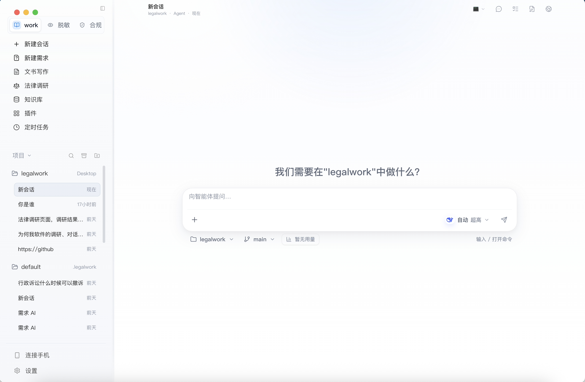

# LegalWork — 法律人工智能工作台

<p align="center">
  <a href="https://github.com/sunyifeisb-art/legalwork/stargazers"></a>
  <a href="https://github.com/sunyifeisb-art/legalwork/network/members"></a>
  <a href="https://github.com/sunyifeisb-art/legalwork/actions/workflows/release.yml"></a>
  <a href="https://github.com/sunyifeisb-art/legalwork/actions/workflows/legalwork-update.yml"></a>
  <a href="./LICENSE"></a>
</p>

<p align="center">
  
  
  
  
  
  
  
  
  
  
  
</p>

<p align="center">
  
</p>

> 🏛️ 面向法律专业人士的 AI 赋能平台<br>
> 集成 OCR 文档识别、敏感信息脱敏、智能案情分析、法律检索、文书生成、合规审查等完整法律 AI 能力

## 🆕 0.3.28 功能更新

- **支持 DeepSeek V4-Flash-Vision-Exp 视觉模型**：发图直接识别，图片作为图像直接传给模型，不再依赖 OCR 提取文字；模型会直接"看到"图片内容并标注"可直接查看"，Agent 也能基于图片完成分析。
- **推理强度默认"高"**：新建对话默认更稳，不再默认超高。
- **模型选择器体验修复**：长模型名（如 deepseek-v4-flash-vision-exp）完整显示，不再截断省略；推理强度标签靠右独立显示，不与模型名重叠。
- 完整变更见下方「🔄 更新记录 → v0.3.28」。

## 🆕 0.3.27 功能更新

- **不再"必须联网才能干活"**：需要实时信息的请求，软件会先自动帮你搜一次最新资料；搜索不成功或网络不可用时也不再阻塞任务，Agent 会改用附件、本地知识库等已有资料换思路完成回答，仅在确实依赖实时信息且无法确认的内容上标注"待实时核验"。
- **网络检索更稳**：内置搜索失败（404、超时、空结果）自动回退备用搜索源，不再导致整轮失败；检索失败不再弹出红色错误，Agent 会基于已有材料继续交付可用的回答。
- 完整变更见下方「🔄 更新记录 → v0.3.27」。

## 🆕 0.3.26 功能更新

- **法律数据源内置控制台**：北大法宝、元典、威科先行、天眼查、企查查都支持在软件内打开控制台窗口（登录、获取/管理凭证），不再依赖外部浏览器。
- **北大法宝每日自动领取积分**：配置面板新增「每日领取 Token」一键自动领取，以及「每日自动领取」开关——每天打开软件、连接成功后自动领取，无需手动操作。
- **首要调研来源真正全局生效**：插件里设置的北大法宝/元典/威科先行优先使用，其鉴权/配额失败时才自动切换另一来源；来源选择以插件配置为准，优先于记忆中的旧偏好。
- **法律调研不再半途被砍**：每轮法律检索调用上限从 8 提升到 20，综合调研能查够材料；报告不完整时自动延续最多 5 次，避免"报告已交付完毕"却无正文。
- **工具小错误自动收起**：连接超时、搜索失败等不影响结论的小错误不再摊开错误详情代码，与正常工具调用一样收起。
- **Mermaid 流程图修复**：中文长标签自动换行不再堆叠；渲染失败时自动修复常见语法错误（独立方向行、subgraph 中文标签未加引号）。
- **SkillHub 体验优化**：分类切换平滑滑动、暗夜模式选中清晰可读、结果缓存秒开；安装技能后立即被 agent 识别并使用；"用户自装"正确显示。
- **连接速度修复**：修复运行时 better-sqlite3 原生模块在 Electron 下加载失败导致的启动/连接明显变慢。
- **附件授权修复**：`~/Desktop` 与 `/Users/xxx/Desktop` 统一规范化比较，不再误报"附件未授权"。
- **斜杠命令技能菜单**：输入 `/` 收纳为「选择 Skill」入口，点击展开常用技能；继续输入文字自动推荐名称最接近的 skill；选择后自动清空命令与输入法残留。
- 完整变更见下方「🔄 更新记录 → v0.3.26」。

## 🆕 0.3.15 功能更新

- **知识库检索升级**：新增增量 SQLite FTS 索引 + 修订感知缓存 + 结构化分块（按标题层级切分、带出处/哈希），检索更快更准；可用 `LEGALWORK_KNOWLEDGE_SQLITE=1` 开启。
- **新增 12 个法律技能库内嵌**：商标助手、Open-Kimi-PPT、法律可视化、元典法律检索、专利申请/下载、法律问答抽取、裁判文书、OPC 法务顾问、引注核查等。
- **支持上传纯 Markdown skill**：只有 SKILL.md 的 skill 导入后自动补 skill.json，可用 `/命令` 显式触发、也能关键词自动激活。
- **中转站 Claude 调用失败原因透传**：不再只报笼统 "Agent turn failed"，余额不足 / HTTP 错误 / 流中断等真实原因会显示出来。
- **脱敏环境安装更稳**：Python 压缩包损坏自动校验并重新下载，不再卡在同一个坏文件上反复失败。
- **界面体验优化**：主对话里不影响功能的工具报错不再红色告警；知识库文件侧栏恢复可拖动调整宽度。
- **稳定修复**：学习线程 Windows 写状态失败自动重试；Windows/Apple 字体排版自适应。
- 完整变更见下方「🔄 更新记录 → v0.3.15」。

## 🆕 0.3.13 功能更新

- **文书写作改版**：上传材料置于首位，下方新增「粘贴/输入案情文字」框；材料/粘贴文字/填写字段三选一即可生成，也可并用；去掉所有字段的必填标记；未提供任何素材时点生成会提醒补充。
- **错误上报携带具体原因**：claw-webhook / schedule-server 等内部服务报错时，上报现在包含具体错误码（如 EADDRINUSE），便于排查；同时严格过滤路径/IP 等隐私信息，不上报用户数据。
- **officecli 升级 1.0.143**：修复 Windows 下二进制加载崩溃、补齐 save 命令版本差异。
- **AI 文书按粘贴文字提取事实**：粘贴的案情文字作为事实来源注入，主体未指定时 AI 会从材料/文字中识别我方立场。
- **修复上传材料不完整**：排查确认「磁盘映像损坏」为下载中断所致，非镜像/打包问题。
- 完整变更见下方「🔄 更新记录 → v0.3.13」。

## 0.3.12 功能更新

- **主界面长文本粘贴即附件**：整段 ≥200 字文字粘贴自动作为「粘贴文本.txt」附件上传（图文混排优先保留正文）。
- **修复连接超时**：runtime 冷启动等待从 4 秒放宽到 12 秒，不再"未在 5 秒内完成"反复重试。
- **流程图渲染更顺滑**：渲染结果缓存 + 重渲染保留旧图，不再一闪一卡。
- **模板上传支持 .doc 老格式**，并取消 10MB 大小限制。
- **OfficeCLI 命令校验加固**：空命令不再透传、报错给正确示例、schema 强化 command 为唯一必需字段。
- **ls/grep/find 容错**：不存在的目录、把文件当目录、权限不足均返回友好提示。
- 完整变更见下方「🔄 更新记录 → v0.3.12」。

## 0.3.11 功能更新

### 📄 文档生成大幅提速（Word / PPT / Excel）

- **Word 生成从 38 步降到 12 步**：文档格式技能内置 officecli 一键生成模板（create → batch → save），不再现场 help 现学语法、不再重复查找技能文件，一次 batch 写完样式+正文+表格+页脚。
- **PPT 支持技能约束**：演示文稿任务现在会触发文档格式技能注入，避免 agent 裸跑自己编流程、逐页截图死循环；提供 PPT 一键生成模板与质检纪律（≤8 次调用、不逐页渲染）。
- **Excel 证据目录模板**：证据目录技能补充 xlsx 一键生成模板，所有单元格写入一个 batch 完成。
- **格式审计降敏**：`fake-numbering`/`space-alignment` 从 warning 降为 info，标题样式不再误判为手打编号；质检只修 error，不再为肉眼不可见的中英文标点混排反复折腾。

### 🐛 稳定性与可靠性

- **修复流式文字重复乱码**：SSE 断线重连时重复投递的文本增量不再叠加（`智能智能对对`这类字符交错从根源消除）；去重阈值与订阅水位分离，避免边界丢字。
- **修复 turn 收尾卡住**：模型流静默 150 秒自动超时收尾，长任务不再永久 `running`（Word/PPT/traj 导出场景）。
- **修复 traj 导出失败**：模型长上下文尾部发出缺 `command` 的无效 bash 调用时自动修复为明确报错，agent 能自纠不再死循环。
- **MCP 重连加固**：断线重连加超时兜底（stdio 45s / 网络 15s），超时后正确关闭泄漏连接，不再无限重连。
- **模型成本优化**：开启 tokenEconomy（工具结果压缩），实测 cache_miss 从百万级降到 2.5 万，复杂任务 token 消耗大幅下降。

## 🆕 0.3.9 功能更新

### 💰 模型成本优化（大幅降低 token 消耗）

- **默认模型改为 flash**：用户未显式选择模型时，主对话、功能调用、知识库问答统一默认使用 DeepSeek `v4-flash`（pro 成本约 3 倍，仅显式选择时使用），显著降低默认开销。
- **压缩阈值调整**：DeepSeek 上下文折叠阈值从 98 万 token 降至 4 万/6 万 token，长对话历史及时折叠，避免无限重放累积 token。
- **知识库工具结果瘦身**：`knowledge_search` / `knowledge_auto_retrieve` 返回结果截断到前 500 字符并限制来源条数（≤8），完整内容按需用 `knowledge_read_file` 分页读取；`web_fetch` 抓取上限从 1MB 降至 96KB。
- **工具调用去重**：同一线程内重复的知识库检索自动短路，避免重复搜索同内容。
- **多轮对话利用 DeepSeek 前缀缓存**：稳定前缀 + 追加新内容，缓存命中率大幅提升（实测复杂任务命中率可达 99%，成本约 0.2 分/次）。

### 🔍 知识库检索正确性修复

- **层过滤不再误杀文档**：修复金字塔层过滤把无层级标记的文档全部排除的问题，检索正确率大幅提升（实测 5/5 正确命中相关文件）。
- **索引文件不再污染检索**：同步时排除 `index.json` / `*.meta.json` 等系统文件，检索结果更干净。

### 🐛 Bug 修复

- **环境安装 EPERM 修复**：Windows 重装 Python 环境时 DLL 被占用导致安装失败，改为先终止占用进程再重试删除。
- **端口冲突自动回退**：运行时端口被占用时自动切换到空闲端口，不再报 `port is in use`。
- **模板写入原子化**：模板源文件改为临时文件 + rename 原子写，避免崩溃留下损坏文件。

### 📝 文书写作与模板增强

- 文书写作模板库、材料参与生成、模板学习与格式导出链路增强。

## 🆕 0.3.8 功能更新

### IMA 云知识库集成

- **两级检索架构**：LegalWork 对 IMA 返回的目录元数据执行轻量目录级 RAG 选库，再调用 IMA 问答接口由 IMA 对库内全文完成最终检索与生成，不复制云端全文、不建立第二套全文索引。
- **`research_ima` 统一工具**：将「读取目录、自动选库、全文问答」封装为一次调用；运行时对知识密集型法律任务执行确定性路由，模型未调用时自动补发同一只读调用。
- **约束与降级**：尊重「不要使用 IMA」及「只使用指定来源」等用户约束；IMA 未连接、认证过期或无匹配时，自动降级到国家法律法规数据库、北大法宝、元典或本地知识库，不阻断其他权威法源。
- **IMA 认证管理**：内置认证管理器，支持扫码登录与登录态持久化。

### 内置法律文书模板

- **内嵌民事起诉状 / 民事答辩状模板库**：按案由组织隐藏式内置模板（`embedded-legal-document-templates`）。
- **`resolve_legal_document_template` 工具**：Agent 起草文书前自动解析内置模板结构；用户已上传或显式指定的自定义模板优先级更高，不会被覆盖。

### AnySearch 网页搜索

- **新增 AnySearch 搜索提供器**：通过 JSON-RPC 2.0 接入 AnySearch MCP API，支持匿名访问（较低限额）与 API Key 两种模式，提供搜索与网页正文提取能力。

### 图片附件自动 OCR

- **对话图片自动识别**：对话中上传的图片附件自动走 OCR 提取文字并注入上下文，支持 DeepSeek 等模型直接消费图片内容，减少手动转写。

### DOCX 格式修复工具

- **`tools/docx_format_fix/`**：新增 .NET 工具，基于 OpenXML 规范化 DOCX 排版（中文字体、字号、间距），用于修复 AI 生成文书的格式问题。

### 文书导出升级

- **多格式导出**：文书导出支持 Markdown / DOCX / HTML，DOCX 导出自动做字体排版规范化（`legal-document-export-service`）。
- **Markdown 导出服务**：新增 `markdown-export-service`，文档导出更稳定。
- **模板生成服务**：新增 `template-generation-service`，模板渲染与生成更可靠。

### 知识库增强

- **DOCX 预览**：知识库文件预览新增 `DocxPreview`，支持直接预览 .docx 文件。
- **知识库视图重构**：文件浏览、AI 对话、侧边栏布局重构，交互更顺滑。

### 学习迭代视图升级

- **学习迭代报告**：`LearningIterationView` 重构，支持学习任务列表、进度跟踪、历史报告查看、取消与回滚。
- **运行稳定性**：修复学习迭代中断在途 LLM 轮次、空闲等待判断等问题，学习迭代按计划模式执行。

### 插件市场大改版

- **插件市场重构**：`PluginMarketplaceView` 全面重构，MCP / Skill 分类标签切换更流畅。
- **详情与安装体验**：插件详情、启动状态、切换动画优化。

### 法律研究面板升级

- **法律研究面板重构**：研究报告生成、编辑、侧边栏布局全面升级。

### UI / 排版

- **Apple 液态玻璃样式**：新增 `apple-liquid-glass.css` 液态玻璃视觉样式。
- **字体排版**：全局字体切换为苹果系统字体体系（SF Pro / PingFang SC / SF Mono），中文显示苹方，正文 17px 行距 1.7。

## 🆕 0.3.7 功能更新

### 文书写作

- **文书格式规范 Skill 增强**：`legal_document_formatting` 新增学术写作规范（`academic-writing.md`）、表格与证据形式（`tables-evidence-forms.md`）、DOCX 格式审计脚本（`audit_docx_format.py`）。
- **文书导出优化**：`legal-document-export-service` 支持更多导出格式，排版更规范。

### 文档识别优化

- **扫描件识别更顺畅**：`document/ocr/router.py` 优化，扫描件和图片材料的处理更稳定。

### 知识库

- **PDF 预览优化**：`PdfJsPreview` 改进，PDF 显示兼容性提升。

### 北大法宝兜底凭证 CI 化

- **加密兜底 Token 入仓**：北大法宝加密兜底凭证随仓库提交，保证 CI 构建产物内置兜底能力；`generate-pkulaw-fallback` 脚本负责生成与维护。

### 更新检查镜像回退

- **GitHub 镜像回退**：中国地区更新检查失败时自动切换到 GitHub 镜像源，保证更新可用。

## 🆕 0.3.6 功能更新

### 上下文压缩工具（Agent 自主调用）

- **新增 `compress_context` 工具**：Agent 可在对话变长时主动压缩历史上下文，减少 token 消耗。参数支持 `keep_recent`（保留最近几条）和 `mode`（普通/激进/强制），返回节省的 token 数和预估费用。
- **模型辅助摘要始终开启**：自动压实和手动压缩均走模型生成摘要，提升压缩质量。

### 北大法宝 MCP 兜底凭证

- **内置兜底 Token**：当用户未配置北大法宝 Token 或 Token 失效时，自动使用加密内嵌的兜底凭据连接，用户无感知。Token 以 XOR+SHA256 加密存储，不写入用户配置、日志、诊断和前端界面。
- **Token 优先策略**：用户配置的 Token 优先使用，失败后自动切换兜底。非北大法宝端点不会发送兜底凭证。
- **Token 编辑入口**：北大法宝和元典 MCP 卡片始终可点击配置，支持查看/编辑已有 Token。
- **凭据保密指令**：系统提示词加入最高优先级安全规则，禁止 Agent 泄露任何 Token 值。

### 插件市场体验优化

- **MCP/Skill 切换动画**：顶部标签切换改用 `AstryxSegmentedControl`，滑动指示器带 `cubic-bezier(0.22, 1.42, 0.36, 1)` 弹簧动画效果。
- **MCP 启动不阻塞**：MCP 服务异步初始化（250ms 延迟），不阻塞应用启动。单个服务失败不影响其他服务连接（Promise.allSettled）。
- **MCP 状态自动刷新**：切换到插件页后，如果 MCP 正在初始化，自动重试直到数据就绪。
- **法律调研线程过滤修复**：修复全角冒号匹配问题，法律调研的线程不会出现在主聊天列表。

### 其他修复

- 修复 `reconnectMcpConnection` 在最后一候选失败时吞掉真实错误的问题
- 修复 pending 诊断中 `enabled`/`status` 不一致的问题
- 修复 MCP 凭据脱敏遗漏 URL、env、args 中密钥的问题
- 修复 `<redacted>` 硬编码导致未来修改失效的问题
- 修复系统提示词数组缺少逗号的编译错误
- 修复 Studio MCP 启动时部分服务 `timeoutMs` 不正确的问题（stdio 60s / streamable-http 全局 30s）
- 增加 MCP `callTool` 失败时自动换候选凭据连接的重试机制

## 🆕 0.3.0 功能更新

这一版重点不是“多了几个按钮”，而是把法律工作里最常见的几条链路补得更顺：从材料进入、事实抽取、文书生成，到知识库检索、插件扩展和脱敏交付，都更接近真实办案和合规工作的使用方式。

### 文书生成更像一个完整工作台

- **模板、历史和知识库联动**：文书生成的模板库、历史记录、知识库面板拆分得更清楚，用户可以一边选模板、一边查团队资料和历史文书。
- **案件材料可直接参与生成**：生成文书时可上传 `txt / md / docx / pdf` 等材料，系统会尽量提取正文内容；扫描版 PDF 会尝试走 OCR，减少手动复制粘贴。
- **模板字段更智能**：模板正文里的占位符会自动补成可填写字段，常见诉讼地位、案号、法院、文书类型等字段会给出更贴合法律场景的输入方式。
- **生成结果更易阅读**：生成后的文书支持 Markdown 渲染，标题、列表、表格等结构更清晰，便于继续编辑和复核。

### 模型与插件配置更省心

- **模型列表自动拉取**：设置模型服务时，可以从兼容接口自动读取可用模型，再勾选要展示的模型，减少手写模型 ID 出错。
- **多模型提供方切换更顺**：在聊天输入区切换模型时，会同步切换对应提供方并重连运行时，适合在不同兼容服务之间切换。
- **Skill 预览更直观**：插件 / Skill 市场现在可以直接预览 Skill 内容、复制 `/skill:` 调用指令，并快速打开本地 Skill 位置。
- **MCP 配置更可靠**：北大法宝等 MCP 配置写入逻辑更稳，重新配置 token 时会按用户意图刷新服务开关。

### 知识库、法律研究和材料阅读更稳

- **知识库文件体验优化**：知识库浏览、文件阅读、聊天历史和材料上下文衔接更自然，适合把法规、案例、模板、项目资料放在一起检索。
- **法律研究 Markdown 更规范**：法律研究结果的 Markdown 处理更稳定，列表、引用、链接和导出内容更适合直接进入报告或备忘录。
- **工作区路径处理增强**：对本地路径、工作区目录和文件引用的处理更稳，减少材料找不到、路径展示不清楚的问题。

### OCR 与脱敏更贴合法律材料

- **OCR 排版更可读**：扫描件和图片 OCR 会根据文字坐标重组行文，尽量保留段落、行距和英文单词空格，减少“识别出来但不好读”的情况。
- **PDF 脱敏有预览文本**：批量 PDF 图片化脱敏会生成预览文本，方便在交付前检查哪些内容被识别和替换。
- **法律规范不再误当主体**：例如《中华人民共和国公司法》这类公开法律规范名称不会再被误识别成“公司主体”而替换，减少法律文本脱敏误伤。
- **中英文主体识别更细**：公司、机构、自然人、英文企业名称等主体识别继续增强，适合合同、尽调、裁判文书和合规材料。

### 发布与更新体验更可靠

- **更新说明更干净**：应用内更新弹窗会过滤构建信息、命令和校验文件名，优先展示用户真正关心的功能变化。
- **macOS / Windows 更新元数据更稳**：自动更新所需的 `latest` 元数据生成规则更严格，减少安装包上传不全或架构不匹配导致的更新失败。
- **版本号已升级到 0.3.0**：桌面应用和内置 Legalwork 运行时版本同步到 `0.3.0`。

## ✨ 功能全景

### 🧠 90 项核心法律 AI 技能 + 1182 项扩展技能

LegalWork 根目录内置 90 项覆盖法律工作全流程的核心技能，并通过 `skills/awesome-legal-aiagent-skills/` 扩展 26 个法律领域、1182 项可选技能包（覆盖并购、仲裁、破产、资本市场、劳动、知识产权、税务、数据合规等专业方向）；另通过 `skills/8203/` 内置「类案纠纷案例库加强版」，提供人民法院案例库提炼的 257 个案由纠纷普通人问答技能。技能采用 agent 按需发现机制：对话中模型可通过 `search_skills` 按任务描述检索技能、`load_skill` 加载选中技能全文（不受注入预算限制）。核心法律技能按领域分类：

#### 📊 案件分析与推理
| 技能 | 说明 |
|------|------|
| `legal-case-analysis` | 案情综合分析 |
| `fact_extraction` | 案件关键事实抽取 |
| `evidence_evaluation` | 证据三性认证与证明力评估 |
| `evidence_argument_chain` | 证据链构建与分析 |
| `evidence-catalog` | 证据目录生成与管理 |
| `argument_chain_construction` | 论证链构建 |
| `argument_strength_evaluation` | 论证强度评估 |
| `deductive_reasoning` | 演绎推理分析 |
| `inductive_reasoning` | 归纳推理分析 |
| `analogical_reasoning` | 类比推理分析 |
| `counterfactual_reasoning` | 反事实推理 |
| `legal_abductive_reasoning` | 法律溯因推理 |
| `systematic_interpretation` | 体系解释分析 |
| `teleological_interpretation` | 目的解释分析 |
| `legal_interpretation_argument` | 法律解释论证 |
| `normative_meaning_argumentation` | 规范意义论证 |
| `judicial_value_judgment` | 司法价值判断分析 |
| `administrative_value_judgment` | 行政价值判断与裁量 |
| `formal_legal_consequence` | 形式法律后果分析 |

#### ⚖️ 裁判预测与评估
| 技能 | 说明 |
|------|------|
| `legal_judgment_prediction` | 裁判结果预测 |
| `legal_risk_assessment` | 法律风险评估 |
| `strategic_risk_prioritization` | 战略风险优先级排序 |
| `internal_compliance_risk_identification` | 内部合规风险识别 |
| `conflict_resolution` | 争议解决方案分析 |
| `dispute_issue_identification` | 争议焦点识别 |
| `dispute_and_performance_risk` | 履约风险分析 |

#### 📝 法律文书
| 技能 | 说明 |
|------|------|
| `document_drafting` | 法律文书起草 |
| `legal_document_formatting` | 法律文书格式规范化 |
| `chinese-legal-citation` | 法学引注格式核查与修订（《法学引注手册》2025版） |
| `legal_document_summarization` | 法律文书摘要生成 |
| `judgment_document_generation` | 判决文书生成 |
| `legal-memo-generator` | 法律备忘录生成 |
| `legal-assessment-report-skill` | 法律评估报告生成 |
| `legal-case-analysis-template` | 案例分析报告模板 |
| `legal-paper-anti-ai-traces` | 法学论文去 AI 痕迹 |
| `legal-thesis-ideation` | 法学论文选题构思 |
| `meeting_minutes` | 会议纪要生成 |
| `case_notebook` | 案件笔记整理 |

#### 📜 知识产权
| 技能 | 说明 |
|------|------|
| `trademark-assistant` | 商标申请类别规划、可注册性初筛与申请材料 |
| `patent-analysis` | 中国发明/实用新型专利结构化分析（权利要求、侵权比对、FTO、无效风险） |
| `code2patent` | 代码仓库转专利技术交底书与发明专利初稿 |
| `patent-download` | 专利 PDF 批量下载（Google Patents 等多平台） |

#### 🔍 法律检索与研究
| 技能 | 说明 |
|------|------|
| `legal_research` | 法律研究分析 |
| `legal_article_retrieval` | 法条检索 |
| `lawcase-search` | 案例检索 |
| `legal-source-verifier` | 法律来源验证 |
| `other_legal_retrieval` | 其他法律资料检索 |
| `chinese_law_verifier` | 中国法律条文核验 |
| `legal_norm_validity_check` | 法律规范效力审查 |
| `new_legislation_analysis` | 新法分析解读 |
| `yuandian-law-search` | 元典法条/案例检索（API，7 节检索报告） |

#### 🔒 合规与风控
| 技能 | 说明 |
|------|------|
| `compliance_review` | 合规审查 |
| `contract_risk_review` | 合同风险审查 |
| `due_diligence` | 尽职调查分析 |
| `data-compliance-ai-rd` | AI 研发数据合规 |
| `presidio-data-compliance` | 数据合规（Presidio 集成） |
| `creator-rights-assistant` | 创作者权益保护 |
| `opc-legal-counsel` | 一人公司/小微企业经营风险分诊 |

#### 📋 案件管理
| 技能 | 说明 |
|------|------|
| `case_management` | 案件管理 |
| `case_lifecycle_planning` | 案件生命周期规划 |
| `case_retrieval` | 案件检索 |
| `trial_scheduling_and_deadline_monitoring` | 庭审排期与期限监控 |
| `timeline_generation` | 时间线生成 |
| `billing_and_litigation_budget` | 计费与诉讼预算 |
| `client_communication` | 客户沟通辅助 |
| `team_knowledge_sharing` | 团队知识分享 |
| `legal_professional_growth` | 法律职业成长 |
| `legal_professional_philosophy` | 法律职业理念 |
| `legal_time_management` | 法律时间管理 |
| `legal_terminology` | 法律术语解释 |
| `legal_concept_comprehension` | 法律概念理解 |
| `legal_element_extraction` | 法律要素提取 |
| `structured_element_extraction` | 结构化要素提取 |
| `multi_document_summarization` | 多文档摘要 |
| `wps-case-file-organizer` | WPS 案件材料整理 |
| `court-sms` | 法院短信解析与文书下载归档 |
| `legal-qa-extractor` | 客户咨询记录提取法律问答对（脱敏） |
| `zheng-ju-cai-liao-zheng-li` | 证据材料整理（证据清单 Word + 带页码证据材料 PDF 合集） |
| `litigation-prep` | 诉讼准备（案由识别、请求权基础、证据清单） |

#### 🛠️ 平台工具
| 技能 | 说明 |
|------|------|
| `ocr_extraction` | OCR 文字提取 |
| `redaction` | 文件脱敏 |
| `watch` | 视频分析与内容提取 |
| `web-access` | 网页访问与浏览器自动化 |
| `deep-research` | 深度研究（GPT Researcher 方法论） |
| `open-kimi-ppt` | AI 生成 PPT/演示文稿（open-kimi-ppt，PPTD + PPTX） |
| `legal-visualization` | 法律图解/关系图/流程图/时间轴（VizSpec，.drawio） |

### 📄 OCR 智能文档识别

基于 `ocr_agent.py` 的完整文档处理流水线：

- **多格式支持**：PDF（含扫描件）、PNG、JPG、TIFF、BMP、WebP、DOCX
- **双引擎 OCR**：PaddleOCR（默认高精度）→ Tesseract（自动降级兜底）
- **自动判断**：`auto` 模式自动识别是否需要 OCR
- **批量处理**：目录批量 OCR 处理
- **LDIR 结构化输出**：统一的法律文档中间表示（Legal Document IR）
- **语义增强**：实体提取、条款层级解析、语义分块
- **坐标级输出**：返回文本块坐标（bbox）
- **对话图片附件自动 OCR**：对话中上传的图片附件自动走 OCR 提取文字并注入 Agent 上下文（`attachment-ocr`），DeepSeek 等模型可直接消费图片内容

```bash
python3 ocr_agent.py scan 扫描合同.pdf
python3 ocr_agent.py batch ./证据材料/
python3 ocr_agent.py pipeline 判决书.pdf
python3 ocr_agent.py auto 文件.docx
```

### 🔏 智能文件脱敏

基于 `redact_agent.py` 和 `redaction/` 模块的完整脱敏系统：

- **敏感实体识别**：身份证号、手机号、邮箱、银行卡号、车牌号、公司名、地址、案号、姓名、金额
- **三种脱敏策略**：
  - `external_client` — 对外发送（遮盖敏感信息）
  - `internal_legal_analysis` — 内部法律分析（Tokenize 保留可读性）
  - `public_release` — 公开发布（完全遮盖）
- **五种脱敏模式**：MASK、REPLACE、TOKENIZE、FULL_MASK、PARTIAL_MASK
- **PDF 坐标级涂黑**：PyMuPDF 像素级矩形覆盖 + 底层文本删除 + Metadata 清理
- **输出产物**：脱敏文档（.redacted.md）、脱敏映射表（.mapping.enc）、脱敏报告（.redaction_report.html）
- **参考规范**：`reference_redaction_mode.py` 提供脱敏模式参考文档

```python
from redaction.pipeline import RedactionPipeline

pipeline = RedactionPipeline()
result = pipeline.process_text(
    text="身份证号：110101199001011234，手机号：13800138000",
    policy_name="external_client",
)
```

### ⚙️ Skill Engine 技能引擎

`skill_engine/` 提供统一的技能执行框架：

- **标准化流程**：intake（文件读取）→ 技能 prompt 加载 → 结果保存
- **自动 OCR 触发**：扫描件自动走 OCR 提取
- **结构化输出**：统一的结果格式（文本、引擎、置信度）
- **CLI 调用**：`python3 run_skill.py <skill-name> <input-file>`

### 🗂️ 案件管理系统

`case_system/` 提供轻量级案件管理：

- **案件建模**：`core.py` 案件核心数据模型
- **Flask API**：`flask_api.py` RESTful 案件管理接口
- **可扩展**：支持自定义案件字段和状态流转

### 📝 文书生成工作台

桌面端内置完整的文书生成链路：

- **模板库 + 历史 + 知识库联动**：文书生成的模板库、历史记录、知识库面板拆分展示，可一边选模板、一边查团队资料和历史文书。
- **案件材料直接参与生成**：生成文书时可上传 `txt / md / docx / pdf` 等材料自动提取正文，扫描版 PDF 走 OCR。
- **模板字段智能补全**：模板占位符自动转可填写字段，常见诉讼地位、案号、法院、文书类型给出贴合法律场景的输入方式。
- **内置法律文书模板**：内嵌民事起诉状 / 民事答辩状结构化模板，Agent 起草前自动解析（`resolve_legal_document_template`）。
- **多格式导出**：生成结果可导出 Markdown / DOCX / HTML，DOCX 自动规范化中文字体排版；支持 Word 导出（SimSun 字体）。
- **历史侧边栏**：生成历史自动保存并刷新列表。

### 🔍 法律研究与学习迭代

- **法律研究面板**：研究报告生成、编辑、侧边栏布局完整流程（`LegalResearchPanel`）。
- **深度研究技能**：内置 `deep-research` 技能（零依赖，GPT Researcher 方法论），支持多源检索与引证报告。
- **学习迭代**：以 Agent 多轮迭代方式对主题深度分析，生成学习报告，支持任务队列、进度跟踪、历史报告、取消与回滚（`learning-iteration-runtime`）。

### 📚 知识库系统

知识库分为「内置法规数据」「可托管知识库」「IMA 云知识库」三层。可托管知识库提供完整的文件管理 + 语义检索 + 自动分类能力，并以 AI 工具的形式开放给 Agent 直接调用。

#### IMA 云知识库

- **云端知识库接入**：集成 [腾讯 IMA](https://ima.qq.com) 云知识库，支持扫码登录与登录态持久化（`ima-auth-manager`）。
- **两级检索**：LegalWork 先对 IMA 目录元数据执行轻量目录级 RAG 选库，再由 IMA 对选中库全文执行检索与生成——不复制云端全文、不建立第二套全文索引（ADR-0001）。
- **`research_ima` 统一工具**：将「读目录 → 自动选库 → 全文问答」封装为一次调用，模型漏调用时运行时自动补发。
- **自动降级**：IMA 不可用时自动回退到国家法律法规数据库、北大法宝、元典或本地知识库。

#### 内置法规数据

`projects/compliance/` 内置海量中国法律法规数据库：

- **法律层级覆盖**：
  - 国家法律（个人信息保护法、数据安全法、网络安全法等）
  - 国家标准与行业标准（GB/T、YD/T 等 50+ 项）
  - 地方规范性文件（覆盖全国各省市）
- **适用场景**：数据合规审查、AI 研发合规、个人信息保护评估
- **持续更新**：可扩展的知识库体系

#### 托管知识库与语义检索

- **多目录接入**：自动扫描 `knowledge-base/`、`knowledge/`、`docs/` 及内置合规知识库等源目录，增量摄取、分块并重建检索索引（`knowledge_sync`）。
- **语义检索**：按关键词 / 法条 / 条款 / 案件名检索，返回带来源路径、匹配分数与摘录的排序结果（`knowledge_search`），条目支持 `category` / `tags` / `keywords` 元数据与排序理由（`rankReason`）。
- **一步自动检索**：给定问题或任务描述，自动检索相关文档、过滤过期/失效内容，并生成带来源引用、可直接注入模型的上下文块（`knowledge_auto_retrieve`）。
- **知识库诊断**：查看文档数、分块数、上次同步时间、启用状态与源目录（`knowledge_diagnostics`）。

#### 文件管理与多格式解析

- **树形浏览 / 读写 / 移动 / 新建目录 / 删除**：完整的知识库文件操作（`knowledge_list_tree`、`knowledge_read_file`、`knowledge_write_file`、`knowledge_create_folder`、`knowledge_move`、`knowledge_delete`）。
- **多格式文本抽取**：支持 Markdown、TXT、JSON/JSONL、CSV/TSV、YAML、HTML/XML 等文本格式，以及 PDF、Word（doc/docx）、Excel（xls/xlsx）等文档解析；并可托管 PPT、音频（mp3/m4a/wav/aac/flac）、图片等资料。

#### 自动分类整理

- **一键归档**：`knowledge_classify` 将混杂文件自动归类到实务类目文件夹——**法规规范、合同协议、诉讼仲裁、案例判例、调研报告、模板范本、音视频、图片资料、表格数据、其他资料**。
- **可预览可选择**：支持 `dryRun` 预览规划中的移动、指定目标根目录、仅处理选中文件；每次移动附归类理由。

#### 外部权威法律源

- **国家法律法规数据库实时检索**：`legal-external-search` 接入 [国家法律法规数据库](https://flk.npc.gov.cn)，支持多策略查询、法规详情抓取与正文 docx 下载解析。
- **北大法宝 / 元典 MCP**：内置 MCP 工具连接北大法宝与元典法律数据库，并提供加密兜底凭证，Token 失效时自动切换，用户无感知。
- **权威来源清单**：`knowledge_legal_external_sources` 返回官方政府网站、司法数据库、学术法律平台等权威外部来源，用于查阅本地知识库之外的最新法规与案例。

#### 团队写作风格库

- `knowledge_writing_style` 提供团队写作风格指南：法律三段论结构、论证节奏、引注要求，以及起诉状、答辩状、法律意见书、代理意见等文书模板与风险提示模板，确保文书风格一致。
- **内置法律文书模板**：内嵌民事起诉状 / 民事答辩状模板库，`resolve_legal_document_template` 工具在起草前自动解析模板结构（用户自定义模板优先）。

### 🧪 评估系统

`evals/` 提供质量评估框架：

- `redaction_evaluator.py` — 脱敏效果评估
- 可扩展的评估指标体系

### 📋 项目规划

`plans/` 包含完整的产品与技术规划文档：

- `legalwork-ai-system-plan-v1.md` — AI 系统技术方案
- `legalwork-product-details-v1.md` — 产品功能详情

---

## 🖥️ 桌面端应用

桌面子项目位于 `apps/desktop-legalwork/`，提供完整的本地 AI Agent 运行时：

- **本地 HTTP/SSE 服务**：`legalwork serve` 启动本地服务
- **线程管理**：创建、管理、fork 对话线程
- **模型集成**：支持 DeepSeek 等 API 兼容模型（模型列表自动拉取、多提供方切换）
- **MCP 协议支持**：集成 MCP 工具服务器，含北大法宝 / 元典 / IMA / Studio 等
- **缓存优化**：Cache-first 架构，LRU/TTL 缓存
- **技能集成**：支持调用上述 90 项核心法律 AI 技能，并可接入 1182 项扩展技能包
- **记忆系统**：长期记忆存储与检索
- **知识检索**：RAG 知识库检索 + IMA 云知识库两级检索
- **附件处理**：图片上传自动 OCR 提取
- **Web 搜索**：内置网页抓取与搜索，含 AnySearch 搜索提供器
- **子代理**：任务委派与并行执行
- **上下文压缩**：Agent 自主调用 `compress_context` 工具压缩长对话上下文
- **对话工具**：`thread_list` / `thread_read` 读取历史对话、`SEND_FILE` 标记发送文件
- **学习迭代**：多轮深度分析生成学习报告
- **插件市场**：内置插件市场，浏览 / 安装 / 管理 Skill 与 MCP 插件

详见 `apps/desktop-legalwork/README.md`。

---

## 🚀 快速开始

### Python 环境

```bash
# 安装依赖
pip install -r requirements.txt

# OCR 依赖（可选）
pip install paddleocr pytesseract pymupdf Pillow

# 运行 OCR
python3 ocr_agent.py auto 文档.pdf

# 运行脱敏
python3 redact_agent.py 文档.docx

# 运行技能
python3 run_skill.py legal-case-analysis 案件材料.pdf
```

### 桌面端应用

```bash
cd apps/desktop-legalwork

# 安装依赖
npm install

# 开发模式
npm run dev

# 构建
npm run build

# 启动服务
legalwork serve --data-dir ~/.legalwork --api-key $API_KEY
```

---

## 🧩 项目结构

```
legalwork/
├── ocr_agent.py              # OCR 智能识别入口
├── redact_agent.py           # 文件脱敏入口
├── run_skill.py              # Skill 执行入口
├── run.sh                    # 服务启动脚本
├── setup.sh                  # 环境安装脚本
├── requirements.txt          # Python 依赖
│
├── document/                 # 文档处理流水线
│   ├── pipeline.py           #   主流水线
│   ├── intake/               #   文件入口路由
│   ├── ocr/                  #   OCR 引擎路由
│   ├── ldir/                 #   LDIR 结构化输出
│   ├── parser/               #   PDF 解析适配器
│   └── semantic/             #   语义增强层
│
├── redaction/                # 脱敏系统
│   ├── detector.py           #   敏感实体检测
│   ├── policy.py             #   脱敏策略引擎
│   ├── pipeline.py           #   脱敏流水线
│   ├── renderer.py           #   渲染器
│   └── renderer_pdf.py       #   PDF 涂黑渲染器
│
├── skill_engine/             # 技能引擎
│   ├── runner.py             #   执行器
│   ├── intake.py             #   文件读取
│   └── output.py             #   结果输出
│
├── skills/                   # 核心法律技能 + 扩展技能商店
│   ├── legal-case-analysis/  #   案情分析
│   ├── fact_extraction/      #   事实抽取
│   ├── evidence_evaluation/  #   证据评估
│   ├── document_drafting/    #   文书起草
│   ├── legal_research/       #   法律研究
│   ├── compliance_review/    #   合规审查
│   ├── legal_document_formatting/  # 文书格式规范化
│   ├── chinese-legal-citation/  # 法学引注格式核查与修订
│   ├── open-kimi-ppt/       #   AI 生成 PPT/演示文稿
│   ├── trademark-assistant/ #   商标申请助手
│   ├── patent-analysis/     #   专利结构化分析
│   ├── legal-visualization/ #   法律图解/图表
│   ├── yuandian-law-search/ #   元典法条案例检索
│   ├── awesome-legal-aiagent-skills/  # 26 领域扩展
│   ├── ...                   #   核心 90 项，扩展 1182 项
│
├── case_system/              # 案件管理系统（检索 + 编排 + Flask API）
│
├── document/                 # 文档处理流水线（OCR / LDIR / 语义）
│
├── redaction/                # 脱敏系统（检测 / 策略 / 渲染）
│
├── evals/                    # 评估框架
│
├── projects/                 # 专业项目模块
│   └── compliance/           #   数据合规（含法规知识库）
│
├── research/                 # 深度研究模块
│
├── knowledge-base/           # 知识库
│
├── plans/                    # 产品与技术规划
│
├── tools/                    # 工具集
│   └── docx_format_fix/      #   DOCX 格式修复（.NET OpenXML）
│
├── scripts/                  # 运维 / 部署脚本
│
├── tests/                    # 测试
│
└── apps/desktop-legalwork/   # 桌面端应用（基于 Kun）
    └── legalwork/            #   Agent 运行时
```

---

## 🛠️ 技术栈

| 层 | 技术 |
|---|------|
| AI 引擎 | DeepSeek API / OpenAI API 兼容 |
| OCR | PaddleOCR, Tesseract, PyMuPDF |
| 文档处理 | python-docx, mammoth, pdf-parse, OpenXML (.NET) |
| 脱敏 | 正则 + NER + 策略引擎 |
| 桌面端 | Electron, TypeScript, React |
| 数据存储 | SQLite, JSONL |
| 云知识库 | 腾讯 IMA（MCP 接入，目录级 RAG 路由） |
| 外部法源 | 国家法律法规数据库 / 北大法宝 / 元典（MCP） |
| 网页搜索 | 内置抓取 + AnySearch MCP |
| 文档导出 | Markdown / DOCX / HTML（字体规范化） |
| 协议 | HTTP/SSE, MCP |

---

## 🔄 更新记录

> 每次代码更新在此追加条目，正式发布 release 时以对应版本号归档。

### v0.3.28

- **支持 DeepSeek V4-Flash-Vision-Exp 视觉模型**：`deepseek-v4-flash-vision-exp` 被正确识别为视觉模型，用户上传的图片直接作为图像传给模型（不再走 OCR 提取文字），模型可直接查看图片内容完成分析；该模型定价与 v4-flash 一致，成本统计准确。
- **推理强度默认"高"**：对话默认推理强度从"超高"调整为"高"，兼顾质量与响应速度。
- **模型选择器 UI 修复**：长模型名（如 `deepseek-v4-flash-vision-exp`）完整显示、不再截断省略；推理强度标签靠右独立显示，不与模型名重叠。

### v0.3.27

- **检索不再作为执行任务必要条件**：需要实时信息的请求，运行时自动预取一次网络信息；预取失败或网络不可用时不再阻塞、不再报错，Agent 改用附件、本地知识等已有资料换思路完成回答，仅对确实依赖实时信息且无法确认的内容标注"待实时核验"。
- **网络检索失败自动降级**：DeepSeek 内置搜索 404 / 超时 / 空结果时自动回退备用搜索源；检索失败不再显示为红色工具错误，Agent 继续交付可用结果。

### v0.3.15

- **知识库检索升级（SQLite FTS）**：新增增量 SQLite FTS 索引（`LEGALWORK_KNOWLEDGE_SQLITE=1` 开启，默认关闭灰度）、修订感知检索缓存、结构化分块（按 `第N章`/标题层级切分，带 headingPath/provenanceId/chunkHash）。检索用 SQLite 粗召回 + 内存精排，与旧评分字节级兼容，失败自动降级。
- **新增 12 个内嵌法律技能库**：trademark-assistant（商标申请/审查/异议）、open-kimi-ppt（演示文稿）、legal-visualization（可视化）、yuandian-law-search（元典检索）、patent-analysis / patent-download、legal-qa-extractor、legal-visualization、chinese-legal-citation（引注核查）、opc-legal-counsel、court-sms、code2patent 等。
- **纯 Markdown skill 自动补全**：导入只有 SKILL.md 的 skill 时自动生成最小 skill.json（含 `/命令` 触发 + frontmatter id 迁移），补齐自动调用能力。
- **中转站 Claude 错误原因透传**：`stop_reason=error` 时产出带原因的 error chunk，turn_failed 透传真实原因（余额不足 / HTTP 4xx / 流中断），不再笼统 "Agent turn failed"。
- **脱敏环境安装 gzip 校验**：Python 压缩包下载后先校验完整性，损坏自动删除缓存重下（跨平台，Windows 无需 gzip 命令）；校验加 30s 超时兜底。
- **学习线程 EPERM 修复**：state.json 写入改用 atomicWriteFile（EPERM/EACCES/EBUSY 重试 + 直写降级），Windows 上不再因文件占用导致学习失败。
- **对话界面优化**：不影响软件功能的工具报错改为中性展示（不再红色告警）；知识库文件侧栏删除 CSS 强制宽度、恢复 JS 拖动；失败的文件修改不再误渲染成 diff。
- **Apple/Windows 字体排版自适应**：平台自适应字体栈（SF Pro / PingFang / Segoe UI + Cascadia Mono），CJK 渲染修复。
- **no-project 工作区 / PDF AI 侧栏响应式 / knowledge chat 修复**：合并多项稳定性修复。

### v0.3.13

- **文书写作改版**：上传材料置于首位，下方新增「粘贴/输入案情文字」框；材料 / 粘贴文字 / 填写字段三选一即可生成，也可并用；去掉所有字段的必填标记；未提供任何素材时点击生成会提醒「请上传材料、粘贴案情文字，或填写必要信息」。
- **AI 按粘贴文字提取事实**：粘贴文字作为「事实来源」注入 agent prompt，AI 会从材料或文字中提取当事人、事实、证据并撰写文书；文书主体未指定时 AI 从材料/文字中识别我方立场。
- **officecli 升级 1.0.143**：修复 Windows 下二进制加载崩溃（System.Private.Xml / System.Collections 找不到）、补齐 save 命令版本差异；文档生成全流程验证通过。
- **错误上报携带具体原因**：claw-webhook / schedule-server 等内部服务报错时，上报现在包含具体错误码（如 EADDRINUSE），便于定位；同时严格过滤路径、IP、文件名等隐私信息，不上报用户数据。
- **文书写作 prompt 加固**：粘贴文字/材料内容含代码围栏（```）时自动转义，防止 prompt 注入逃逸。

### v0.3.12

- **主界面支持长文本粘贴为附件**：粘贴 ≥200 字的整段文字会整体作为「粘贴文本.txt」附件上传（含图文混排时优先保留正文），不再塞进输入框。
- **修复连接超时**：runtime 冷启动耗时撞上 4 秒超时导致"连接未在 5 秒内完成"反复重试，启动等待放宽到 12 秒。
- **流程图渲染优化**：同一张图不再重复渲染（结果缓存）；重新渲染期间保留旧图不闪回加载态；修复切主题/新消息时闪错图的问题。
- **模板上传支持老版 .doc 文件**：文书模板上传新增 `.doc`（Word 97-2003）格式，并取消单个文件 10MB 大小限制。
- **OfficeCLI 命令校验加固**：空命令/空数组不再透传；报错时给出正确用法示例帮助模型自纠；工具 schema 强化 command 为唯一必需字段，减少模型拆参漏参。
- **文件工具容错**：ls/grep/find 对不存在的目录、把文件当目录、权限不足三类错误返回友好提示，不再抛裸 ENOENT/ENOTDIR/EPERM。

### v0.3.11

- **文档生成大幅提速**：Word 生成 38 步 → 12 步（内置 officecli 一键模板）；PPT 触发技能约束 + 一键生成模板；Excel 证据目录补 xlsx 模板；格式审计降敏（fake-numbering 降 info、只修 error）。
- **修复流式文字重复乱码**：SSE 断线重连重复投递不再叠加，去重阈值与订阅水位分离避免边界丢字。
- **修复 turn 收尾卡住**：模型流静默 150s 自动超时，长任务不再永久 running。
- **修复 traj 导出失败**：缺 `command` 的无效 bash 调用自动修复，agent 可自纠。
- **MCP 重连加固**：断线重连加超时（stdio 45s/网络 15s），泄漏连接正确关闭。
- **模型成本优化**：开启 tokenEconomy，cache_miss 从百万级降至 2.5 万。

### v0.3.10

- **模型设置更清晰**：设置新增「模型配置」独立入口，模型服务、认证方式、API Key、服务地址、模型列表集中管理，不用再去「通用」和「AI 助手」两处翻。
- **支持 ChatGPT 账号认证**：认证方式可选「API Key」或「ChatGPT 账号」，选 ChatGPT 账号后用订阅额度，无需填 Key，主页模型自动跟随账号可用模型。
- **支持更多第三方模型服务（中转站）**：设置里可选模型服务对接协议，中转站、Claude 中转、OpenAI 中转都能接；自动识别官方服务与中转站，接 DeepSeek 模型更稳、费用显示更准。
- **数据合规与脱敏升级**：脱敏识别能力增强（自然人姓名、企业名称、律所、地址、电话、身份证号、银行卡号、邮箱、账号、出生日期、IP 等十余类敏感信息分类识别）；脱敏结果支持导出 Word / PDF / Markdown / 纯文本；合规面板交互优化。
- **对话文件列表改悬浮小窗**：点「对话文件」按钮才弹出悬浮列表，点文件后才开右侧预览，不占主界面，也不再默认自动弹出。
- **新能力**：对话支持渲染 Mermaid 图表（架构图/流程图）；识别"生成/整理 Word 文档"指令自动走文档流程；IMA 知识库运行时升级。
- **法律调研更稳定**：修了"规划后卡住""只出规划没检索""规划跑进总结"；只生成规划未检索时会明确提示，不再误报完成；阶段播报编号对齐；调研记录不再混进主页对话。
- **对话文件更好用**：同一文件不再重复显示；日期/网址等非文件条目不再混入；图片附件标出格式；更多文本/代码格式可预览。
- **知识库文件预览修复**：对话引用的知识库 PDF 等文件不再报"找不到文件"。
- **稳定性修复**：认证方式切换失效、SSE 偶发断流、调研中止丢内容等问题。

### v0.3.9

- **默认模型改为 flash**：未显式选择时统一使用 DeepSeek v4-flash，大幅降低默认成本。
- **压缩阈值 98万→4万/6万**：长对话历史及时折叠，避免 token 无限累积。
- **知识库工具结果瘦身**：search/auto_retrieve 截断到 500 字符 + 来源条数上限，web_fetch 上限降至 96KB。
- **工具调用去重**：重复知识库检索自动短路。
- **多轮对话利用前缀缓存**：缓存命中率大幅提升（复杂任务实测 99%）。
- **检索正确性修复**：层过滤不再误杀无标记文档，检索正确率大幅提升；排除 index.json/meta.json 污染。
- **Bug 修复**：EPERM 安装失败、端口冲突自动回退、模板原子写入。
- **文书写作与模板增强**：模板库、材料参与、模板学习与格式导出链路增强。

### v0.3.8

- **IMA 云知识库集成**：目录级 RAG 路由 + IMA 全文问答，`research_ima` 统一工具，运行时自动路由，支持扫码登录与降级。
- **内置法律文书模板**：内嵌民事起诉状 / 答辩状模板库，`resolve_legal_document_template` 工具自动解析模板结构。
- **AnySearch 网页搜索**：新增 AnySearch 搜索提供器（JSON-RPC 2.0 接入 MCP API，支持匿名与 API Key）。
- **图片附件自动 OCR**：对话图片附件自动提取文字注入上下文。
- **DOCX 格式修复工具**：新增 .NET 工具基于 OpenXML 规范化 DOCX 排版。
- **文书导出升级**：支持 Markdown / DOCX / HTML 多格式导出，DOCX 字体排版规范化。
- **知识库 DOCX 预览**：新增 `DocxPreview` 支持直接预览 .docx 文件。
- **学习迭代视图升级**：学习任务列表、进度跟踪、历史报告、取消与回滚。
- **插件市场重构**：MCP / Skill 分类切换与安装体验升级。
- **法律研究面板重构**：研究报告生成、编辑、侧边栏布局全面升级。
- **Apple 液态玻璃 UI**：新增液态玻璃视觉样式与苹果字体体系。

### v0.3.7

- **文书格式规范 Skill 增强**：`legal_document_formatting` 新增学术写作规范、表格证据形式、DOCX 格式审计脚本。
- **文书导出优化**：`legal-document-export-service` 支持更多导出格式，排版更规范。
- **扫描件识别优化**：`document/ocr/router.py` 优化扫描件与图片处理。
- **北大法宝兜底凭证 CI 化**：加密兜底 Token 随仓库提交，保证 CI 构建产物内置兜底能力。
- **更新检查镜像回退**：中国地区更新检查失败自动切换 GitHub 镜像源。

### v0.3.6

- **上下文压缩工具**：`compress_context` 工具，Agent 主动压缩长对话上下文，减少 token 消耗。
- **北大法宝 MCP 兜底凭证**：Token 失效时自动切换加密兜底凭据，用户无感知。
- **插件市场体验优化**：MCP/Skill 切换动画、异步初始化不阻塞、状态自动刷新。
- **修复**：MCP 重连、凭据脱敏、候选凭证切换、timeoutMs 等多项修复。

### v0.3.5

- **苹果字体排版**：全局字体切换为 SF Pro / PingFang SC / SF Mono，中文苹方显示。
- **阅读体验**：对话正文 13px → 17px，行距 1.7。
- **CJK 渲染修复**：修复 Chromium 字体合成导致的汉字字形损坏。

### v0.3.4

- **PDF 预览修复**：修复 ResizeObserver 导致的预览闪屏循环。
- **知识库 AI 对话**：模型跟随主 Agent 当前选择，不再硬编码 deepseek-chat。
- **AI 侧边栏宽度自适应**：最大宽度提升至 580px。

### v0.3.3

- **学习迭代稳定性**：修复 isBusy 中断在途 LLM 轮次、forceRun 重试空转等问题，学习迭代按计划模式执行。
- **文书生成修复**：修复模板为空时崩溃。
- **消息模型标签**：修复模型标签显示 'auto' 的问题，正确回退到线程模型。

### v0.3.2

- **金字塔知识库**：5 层知识结构（原则→架构→标准→实现→经验）、层级路由、层级感知检索。
- **引用准确性优化**：GB/T 7714 引注引擎、引用校验工具、防幻觉提示。
- **深研技能**：新增 `deep-research` 技能（零依赖，GPT Researcher 方法论）。
- **Word 导出按钮**：AI 生成文书支持 Word 导出（SimSun 字体）。
- **对话工具**：`thread_list` / `thread_read` 访问历史对话、`SEND_FILE` 标记发送文件。
- **学习迭代**：手动触发跳过空闲等待。

### v0.3.1

- **修复优化**：版本准备与稳定性修复。

### v0.3.0

- **文书生成工作台**：模板、历史、知识库三方联动；案件材料直接参与生成；模板字段智能补全；Markdown 渲染。
- **模型与插件配置**：模型列表自动拉取、多模型提供方切换、Skill 预览、MCP 配置更可靠。
- **知识库、法律研究、材料阅读优化**：Markdown 更规范、工作区路径处理增强。
- **OCR 与脱敏**：OCR 排版重组更可读、PDF 脱敏预览文本、法律规范不再误当主体、中英文主体识别增强。
- **发布更新**：更新说明过滤构建信息、macOS/Windows 更新元数据更稳、版本号同步 0.3.0。

### v0.2.9

- **OfficeCLI 集成**：打包自动恢复原生 binary，运行时注入 OfficeCLI MCP server。
- **Agent 附件本地路径引用**：附件支持 `localFilePath`，文件类任务处理更精准。
- **数据合规本地引擎优化**：依赖拆分、安装标记、启动提速、任务中断状态标记。
- **脱敏主体识别增强**：法定代表人、委托诉讼代理人、律所、公司/机构等更多识别规则。

### v0.2.8

- **知识库对话历史**：左侧边栏新增「知识库对话」记录列表，可查看、切换和删除历史对话，文件级与全局知识库问答均支持多轮续聊。
- **知识库多轮对话连续性**：文件预览页和全局知识库的 AI 对话改为复用同一会话上下文，不再每次新建对话，避免上下文中断。
- **PDF 预览升级**：知识库文件预览改用 pdf.js 直接渲染 base64 内容，提升 PDF 兼容性与显示清晰度。
- **文件聊天面板可折叠与拖拽**：文件详情页的 AI 对话面板支持一键展开/收起，并可拖拽调整宽度，更灵活地利用屏幕空间。
- **Agent 文件访问范围设置**：设置页新增「仅访问编辑项目文件」开关，开启后 Agent 只能操作当前工作目录，降低误操作风险。
- **聊天执行过程默认展开**：消息时间轴中的工具调用、推理与执行过程默认展开显示，无需手动点击即可查看 AI 的完整思考链路。
- **数据合规本地引擎优化**：启动提示与进度展示更直观，Python 环境校验更严格，并增加 PaddleOCR 后端支持，提升本地脱敏/合规任务的稳定性。

### v0.2.7

- **自动更新兜底安装**：macOS 在原生 updater 未触发应用退出时，自动通过已下载的 zip 执行 shell 兜底安装，降低更新失败概率。
- **数据合规批量任务**：支持一次提交多个文件进行合规审查/脱敏，自动生成 `input_manifest.json` 并统一调度；worker 侧扩展 Excel、PPT、PDF、OCR 等文件解析能力。
- **文书生成历史侧边栏**：将历史记录从弹窗迁移为左侧边栏，生成完成后自动保存记录并刷新列表。
- **法律研究与知识库优化**：继续改进文件预览、分类与问答交互体验。
- **web-access skill 增强**：新增 CDP proxy 脚本与 API 参考文档，完善浏览器自动化链路。

### v0.2.6

- **发送图标视觉升级**：统一替换为新的 `SendIcon` 实心纸飞机组件，覆盖主输入框、知识库问答、文件预览问答、开发者浏览器等 4 处发送按钮。
- **知识库 PDF 预览修复**：`KnowledgeBaseFileView` 移除 `pdfjs-dist` canvas 渲染链路，改用 `iframe` 加载 Blob URL，解决 Electron 中 PDF 页面空白的问题。
- **知识库 AI 智能分类增强**：
  - 新增基于文件名的规则分类 + 基于文本内容的正则分类
  - 接入模型客户端做智能分类，支持候选类目和超时回退
  - 分类前读取可提取文档的文本片段作为模型输入
- **知识库文件预览支持 AI 对话**：在 `KnowledgeBaseFileView` 中内置基于当前文件内容的 RAG 问答面板，可直接就文件内容提问。

### v0.2.5

- **修复文本提取器严重缺陷**：`text-extractor.ts` 中的正则表达式被 NUL 字节污染为 `/./g`，导致 PDF/Word/Excel/OCR 提取的文本全部清空；已修复为正确的控制/零宽字符过滤。
- **数据合规运行时生命周期加固**：新增 `AbortController` 取消机制，`stop()` 与 `ensure()` 之间不再产生死锁或僵尸进程。
- **路径遍历防护**：`attachment-store`、`knowledge-store`、`data-compliance-task-service` 均增加目录逃逸校验，拒绝非法 ID 与 `../` 路径。
- **前端表单与附件修复**：
  - `AstryxButton` 正确支持 `type="submit"`
  - `ScheduleTasksView` 中 toggle 外层改为可聚焦的 `role="switch"` 容器，恢复整行点击并消除按钮嵌套
  - `Workbench` 中 `URL.createObjectURL` 生成的 blob URL 在附件移除/清空/组件卸载时正确释放
- **恢复大文件前端保护**：数据合规面板 50MB、文书模板上传 10MB 上限及对应 i18n 提示。
- **Agent 线程中断串行化**：`claw-runtime` 中复用 IM thread 前先顺序中断 stale turns，避免并发导致状态混乱。
- **Worker 子进程稳定性**：`data-compliance-task-service` 将 stdout/stderr 直接重定向到日志文件流，避免 pipe 缓冲区死锁；轮询增加 30 分钟上限并在超时后标记任务失败。

### v0.2.4

- **修复 agent-loop 系统提示回归**：`goalContinuationInstruction` 的模板字符串意外跨行包含了后续常量定义与函数源码,导致系统提示把 TypeScript 代码发给模型；已修复为正确的单句提示。

### v0.2.3

- **用户自装 Skill**：支持从本地文件夹或 zip 包导入 Skill 到 `~/.legalwork/skills/`,插件市场新增「用户已安装」分类与导入按钮,并带 zip 路径穿越防护。
- **Agent 运行稳定性**：
  - 单轮目标续传增加 32 步硬上限,防止无工具调用的空转循环
  - SSE 文本增量改为 32ms 批量刷新,减少前端渲染压力
  - 修复 MCP tool provider 状态覆盖问题
  - 运行时启动增加并发去重与健康检查等待
- **DeepSeek 兼容**：思考模式不再限制特定 host,任何支持思考的模型均可启用。
- **诊断与配置**：内存记录仅在 capability 可用时加载;存储键从 `deepseekgui.*` 迁移到 `legalwork.*`。
- **发布流程**：重构 GitHub Actions,使用 artifact 集中上传 release asset。

### v0.2.2

- **修复自动更新安装兜底逻辑**：改进 updater 在安装失败时的回退处理。

### v0.2.1

- **法规知识库接入国家法律法规数据库**：`legal-external-search` 从静态站点清单升级为实时检索 [国家法律法规数据库](https://flk.npc.gov.cn)，支持多策略查询、法规详情抓取与正文 docx 下载解析。
- **知识库自动分类**：新增 `KnowledgeClassify` 契约与接口，可按类目自动归档知识库文件，条目支持 `category` / `tags` / `keywords` 元数据及排序理由（`rankReason`）。
- **插件市场分类化**：插件按「法律与合规、数据处理、编码开发、前端设计、浏览器与网页、检索研究」等 15 个类目分组展示，并支持配置访问令牌。
- **对话时间线体验优化**：输入请求 / 错误 / 提醒按数量分组折叠，展示任务已用时长（`已用 {duration}`）。
- **Git 分支选择与错误提示**：补充未选工作目录、非 Git 仓库、缺少 Git 可执行文件等中文错误提示。
- **数据合规面板与图片附件上传**：交互与上传逻辑完善，新增对应单元测试。
- **技能更新**：`chinese_law_verifier`、`legal_article_retrieval`、`legal_research` 说明与检索逻辑同步更新。
- **文档更新**：README 新增「知识库系统」完整章节，覆盖语义检索、文件管理、多格式解析、自动分类、外部权威源、写作风格库。

---

## 📄 许可证

本仓库所有代码统一采用 **PolyForm Noncommercial License 1.0.0**，仅限非商业用途。详见根目录 [`LICENSE`](./LICENSE)。

桌面端 agent runtime 基于 [Kun](https://github.com/KunAgent/Kun)（© 2026 xingyu），相关声明同步保留在 [`apps/desktop-legalwork/LICENSE`](./apps/desktop-legalwork/LICENSE)。

---

## 🙏 致谢

- 桌面端 agent runtime 基于 [Kun](https://github.com/KunAgent/Kun)（© 2026 xingyu）
- OCR 引擎使用 [PaddleOCR](https://github.com/PaddlePaddle/PaddleOCR) 和 [Tesseract](https://github.com/tesseract-ocr/tesseract)
- 脱敏参考 [Presidio](https://github.com/microsoft/presidio) 设计模式
- 法律 Skill 体系的设计参考了清华大学法律智能 / 法律 AI 相关公开 Skill 的任务拆分、法律推理和文书工作流思路。
- IMA 知识库接入参考了社区项目 [tencent-ima-copilot-mcp](https://github.com/highkay/tencent-ima-copilot-mcp) 和 [ima-cli](https://www.npmjs.com/package/ima-cli) 的 Q&A 接口调用方法与认证方案。
- 也感谢社区中公开发布法律、合规、检索、写作和数据处理 Skill 的作者；LegalWork 的 Skill 库在设计分类、提示结构和场景覆盖时参考了这些开放实践。
